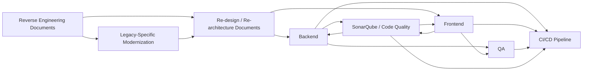

# Multi-Agent Architecture

## Operating Model

The eight agents work as a modernization delivery chain. Each agent can run independently, but the best results come from passing artifacts forward through the sequence:

## Context Model

Agents should preserve and reuse these context artifacts when available:

- Requirements, user stories, acceptance criteria, and business process notes
- As-Is architecture and codebase inventory
- Legacy platform assessment, artifact inventory, component mapping, and migration roadmap
- To-Be architecture and decision log
- API contracts and data model
- Security, authentication, authorization, and compliance requirements
- Testing strategy, test data, and environment details
- Quality gate thresholds and scan reports
- Deployment environments, release gates, and rollback strategy

## Approach Flexibility

The agents must support different modernization approaches:

- Rehost, replatform, refactor, rearchitect, rebuild, replace, or retire
- Big bang, strangler fig, phased module-by-module, API-first, data-first, or UI-first migration
- Monolith, modular monolith, microservices, event-driven, serverless, cloud-native, hybrid, or on-prem deployment
- Greenfield development, brownfield enhancement, packaged product integration, legacy wrapping, or technology-specific migration

## Decision Gate Principles

1. Ask targeted questions before irreversible structure decisions.
2. If answers are missing, propose options with tradeoffs and mark assumptions.
3. Prefer existing repository conventions when modifying an existing project.
4. Keep traceability from requirement to design, implementation, test, quality gate, and deployment.
5. Document risks, constraints, dependencies, and open questions at every handoff.